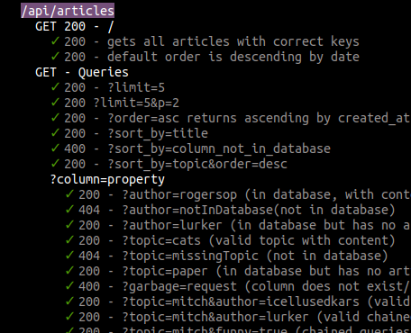

# doug-news

> _A Node.js server with RESTful API for an online news app_

> _Built at Northcoders!_

---

### Built with:

- Node.js
- Express
- Knex & node-pg

### TDD Tested using:

- Mocha
- Chai
- Supertest

---

# How to use on linux

#### Install dependancies (`Git`, `Node.js`, `PSQL`):

```bash
sudo apt-get update && sudo apt-get upgrade && sudo apt-get install git && curl postgresql postgresql-contrib && touch ~/.bash_profile && curl -o- https://raw.githubusercontent.com/creationix/nvm/v0.33.6/install.sh | bash && source ~/.nvm/nvm.sh && nvm install node && nvm use node && sudo -u postgres createuser --superuser $USER
```

#### Setup `psql`

```bash
psql
```

Then enter the following, instead of '_username_' type your linux username and instead of '_mysecretword123_' choose your own password and be sure to wrap it in quotation marks.

Use a simple password like 'password'. DONT USE YOUR LOGIN PASSWORD!

```psql
ALTER USER username WITH PASSWORD 'mysecretpassword123';
```

you can exit with `\q`

#### Clone this repository and enter directory

```bash
git clone https://github.com/douglashellowell/nc-news.git
```

#### Create a database config file - '`knexfile.js`'

Replace `username` and `mysecretpassword123` with your psql settings from above

```js
// put this in the root directory
// nc-news/knexfile.js

const ENV = process.env.NODE_ENV || 'development';

const baseConfig = {
	client: 'pg',
	migrations: {
		directory: './db/migrations'
	},
	seeds: {
		directory: './db/seeds'
	}
};

const customConfig = {
	development: {
		connection: {
			database: 'nc_news',
			user: 'username',
			password: 'mysecretpassword123'
		}
	},
	test: {
		connection: {
			database: 'nc_news_test',
			user: 'username',
			password: 'mysecretpassword123'
		}
	}
};

module.exports = { ...customConfig[ENV], ...baseConfig };
```

#### Install the node.js dependencies

**-either-** just the server:

```bash
npm install --only=prod
```

**-or-** everything - including testing tools:

```bash
npm install
```

#### Create and seed database

```bash
npm run setup-dbs && npm run migrate:latest && npm run seed
```

#### Test server (if testing tools installed)

```bash
npm test
```



#### Run server

```bash
npm start
```

> The console should print out...
>
> ```
> app is listening on port 9090
> ```
>
> The server is now accepting requests on localhost:9090/
> Try making requests in your browser:
> http://localhost:9090/api > http://localhost:9090/api/topics > http://localhost:9090/api/articles

---

## Functionality

### `GET: /api`

> serves up a json representation of all the available endpoints of the api

### `GET: /api/topics`

> serves an array of topics in database

example response:

```js
{
	topics: [
		{ slug: 'UK', description: 'National and Local News' },
		{
			slug: 'Tech',
			description: 'Latest Software, Hardware and Tech Industry News'
		},
		{ slug: 'Gaming', description: 'All things gaming' }
	];
}
```

### `GET: /api/articles`

> serves an array of articles in database

example response:

```js
{
  "articles": [
    {
      "article_id": 1,
      "title": "Seafood substitutions are increasing",
      "topic": "UK",
      "author": "weegembump",
      "body": "Text from the article..",
      "created_at": 1527695953341,
      "comment_count": "13",
      "votes": 58
    },
    {
      "article_id": 2,
      "title": "Open to any Super Smash Bros Challenges...",
      "topic": "Gaming",
      "author": "doug123",
      "body": "Text from the article..",
      "created_at": 1527695953341,
      "comment_count": "17",
      "votes": 72
    }
  ]
}
```

### `GET: /api/articles/:article_id`

> serves an object with article data from specified article_id

```js
{
  "article":
    {
      "article_id": 1,
      "title": "Electron and Node.js on the desktop",
      "topic": "Tech",
      "author": "doug123",
      "body": "Text from the article..",
      "created_at": 1527695953341,
      "comment_count": "20",
      "votes": 97
    }
}
```

### `PATCH: /api/articles/:article_id`

> updates 'votes' of article and returns updated article to user

example patch data:

```js
{
	inc_votes: 1;
}
```

```js
{
	inc_votes: -1;
}
```

### `GET: /api/articles/:article_id/comments`

> serves an array of comments for specified article

example response:

```js
{
"comments": [
  {
    "comment_id": 14,
    "author": "icellusedkars",
    "article_id": 5,
    "votes": 16,
    "created_at": "2004-11-25T12:36:03.389Z",
    "body": "Really fascinating! I've got to use this in the future!"
  },
  {
    "comment_id": 15,
    "author": "butter_bridge",
    "article_id": 5,
    "votes": 1,
    "created_at": "2003-11-26T12:36:03.389Z",
    "body": "This is so funny i'm going to get it tattoo'd"
  }
]
}
```

### `POST: /api/articles/:article_id/comments`

> posts a comments associated with specified endpoint and responds with uploaded comment (user must exist)
> example post:

```js
{
  "username": "broccoli55",
  "body": "This article is interesting!"
}
```

example response:

```js
{
  "comment": {
    "comment_id": 19,
    "author": "broccoli55",
    "article_id": 2,
    "votes": 0,
    "created_at": "2019-12-12T11:19:19.306Z",
    "body": "This article is interesting!"
  }
}
```

### `PATCH: api/comments/:comment_id`

> Updates 'votes' on specified comment and returns updated comment to user

example patch data:

```js
{
	inc_votes: 1;
}
```

```js
{
	inc_votes: -1;
}
```
